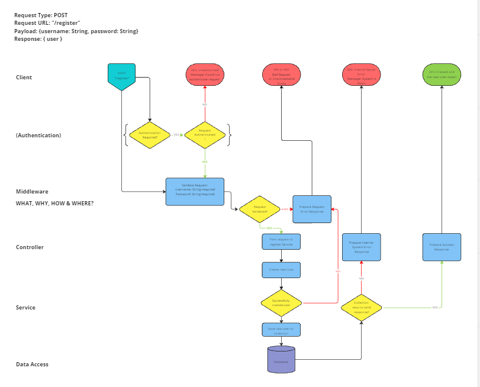

# User Stories

1. As a user I want to be able to register an account with the application, so that I can save my preferences.
2. As a user I want to be able to login to my account with my given details, so that I can access my account.
3. As a user I want to be able to change my password for my account, so that I can change my details if needed.
4. As a user I want my saved preferences to be secure and my details checked when requesting them, so that my data is secure.
5. As a user I want to be able to request my stored locations, so that I can see my saved data.
6. As a user I want to be able to add a new saved location, so that I can add to my saved data.
7. As a user I want to be able to remove a saved location, so that I can get rid of unwanted data.

